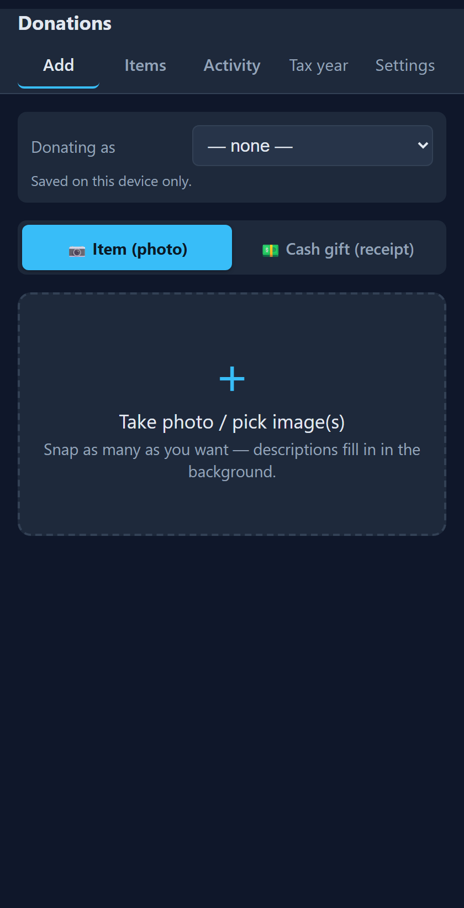
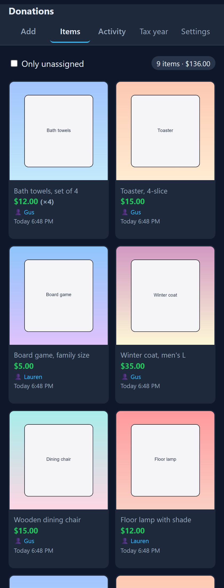
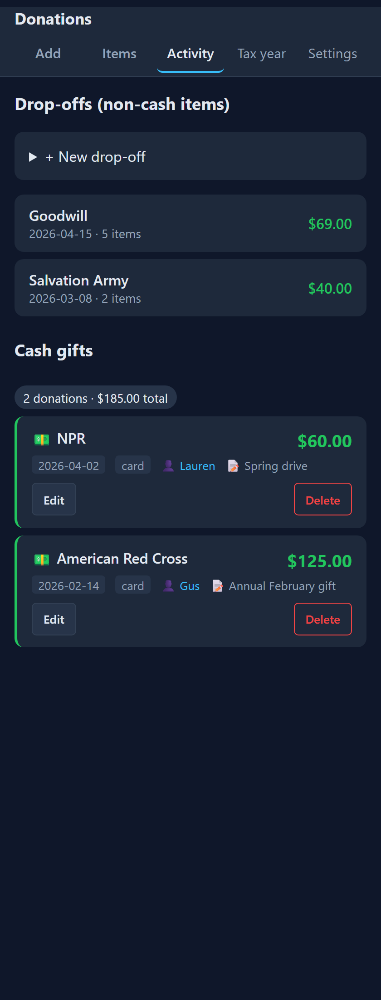
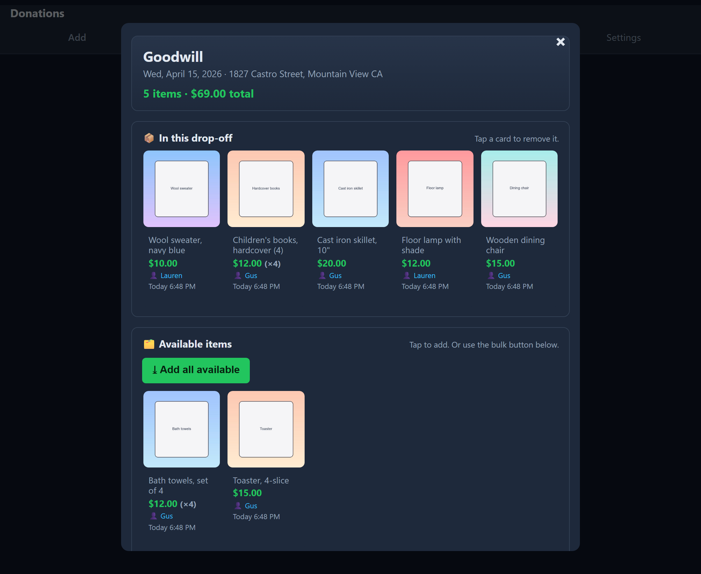
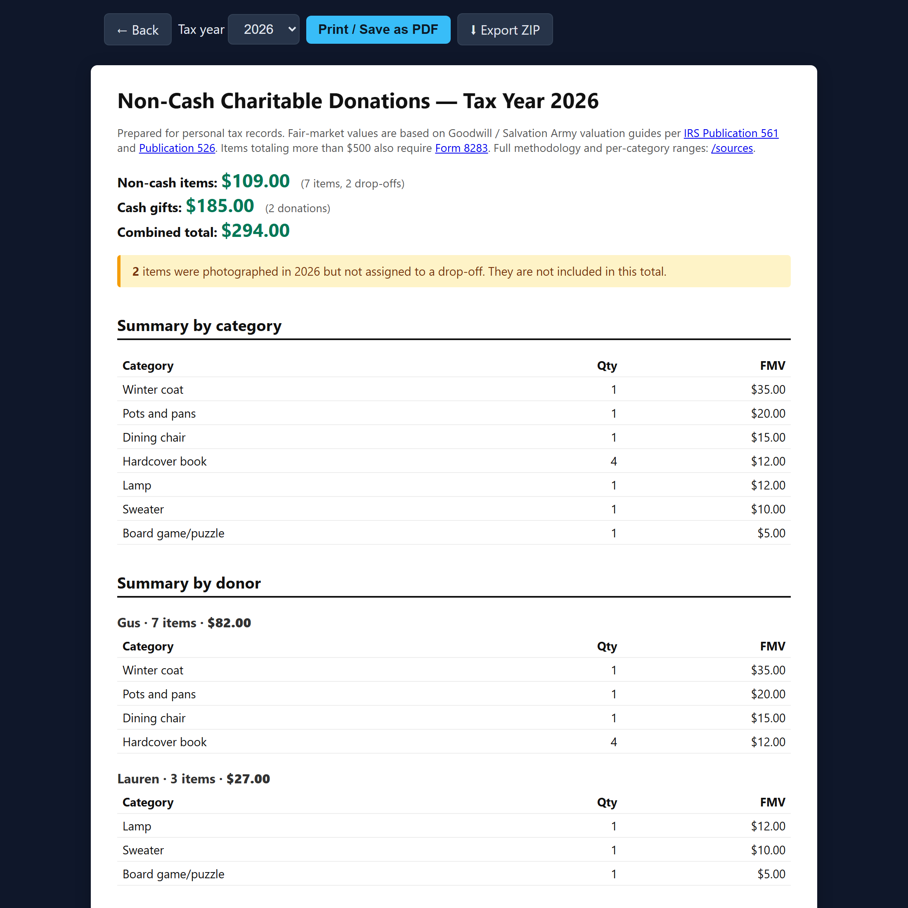
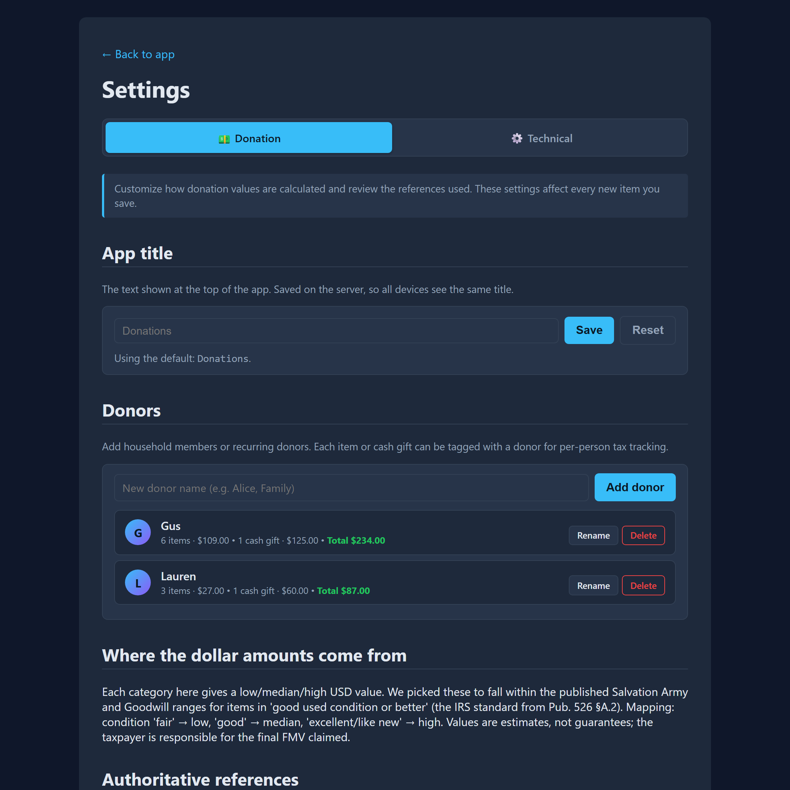
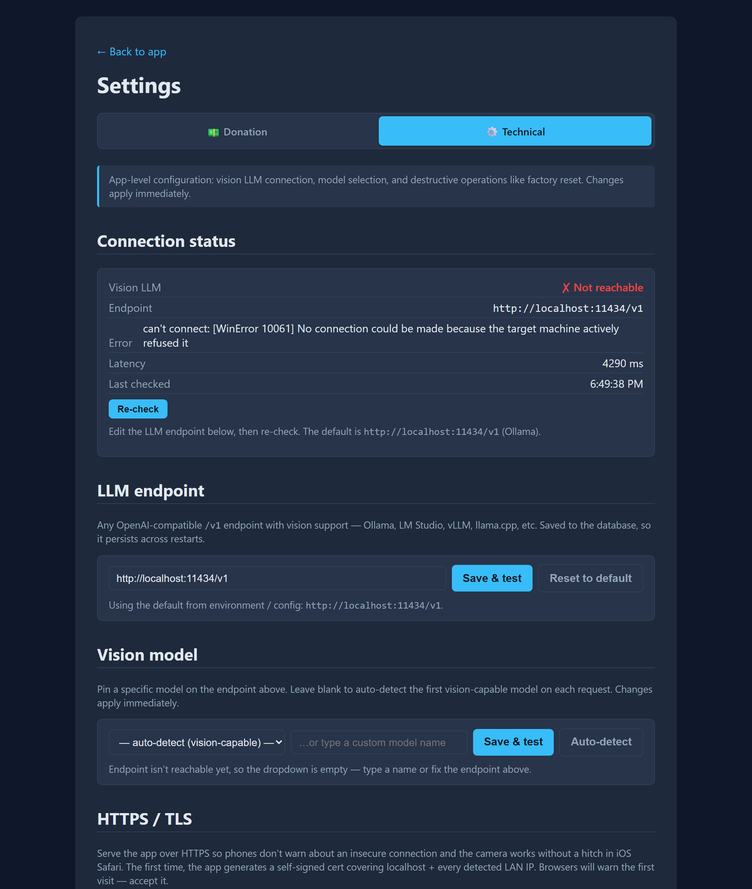

# Donation Tracker

A tiny, local, mobile-first web app for tracking non-cash and cash charitable donations for tax purposes.

Snap photos of items from your phone, a vision LLM auto-fills the description and category, fair-market values are looked up from a bundled IRS-style table, and you get a printable per-charity receipt and a year-end summary suitable for IRS Form 8283.

Self-hosted, no auth, no cloud, no telemetry. All data stays on your machine. Designed to be reachable from any phone on your home network.

<p align="center">
  
  
  
</p>

## What it does

- **Take a photo** from your iPhone or Android — the device camera opens directly via a single tap.
- **Vision LLM** (any OpenAI-compatible endpoint: Ollama, LM Studio, vLLM, llama.cpp, ...) generates a description, picks a category, and judges the condition.
- **Fair-market value** is looked up from a bundled, editable table modeled on the [Salvation Army](https://satruck.org/donation-value-guide) and [Goodwill](https://www.amazinggoodwill.com/donating/IRS-guidelines) valuation guides per [IRS Pub. 561](https://www.irs.gov/pub/irs-pdf/p561.pdf). Condition picks low / median / high.
- **Group items into "drop-offs"** (date + charity). Print a per-drop-off receipt or a per-tax-year summary that shows totals by charity, category, and donor.
- **Cash gifts** with optional receipt photo or PDF (charity acknowledgment letter, bank statement, etc.).
- **Donors** — add household members and tag who gave each item; the per-donor breakdown lets multiple people in one household track their own contributions.
- **Async pipeline** — uploads return instantly so you can snap a dozen photos in a row; the LLM works in the background and the UI updates as each item is analyzed.
- **Export** — one-click ZIP of the SQLite DB, an Excel-readable CSV, and every photo.

### Drop-off detail

Tap-to-add / tap-to-remove makes assigning items to a drop-off effortless:

<p align="center">
  
</p>

### Tax-year report (for IRS Form 8283)

Per-charity, per-category, and per-donor breakdown. Combined cash + non-cash totals. Auto-callouts for IRS thresholds ($500 → Form 8283, $5,000 → qualified appraisal). Print-friendly.

<p align="center">
  
</p>

### Settings

Two sub-sections. **Donation** holds donor management, the editable FMV table, methodology + IRS references, and export. **Technical** holds the LLM endpoint config, vision-model picker (auto-detects which loaded models support vision), HTTPS / TLS toggle and custom-cert upload, auto-update from GitHub, and factory reset.

<p align="center">
  
  
</p>

## Requirements

- A machine you can reach from your phones — a Linux box, a Raspberry Pi, a Proxmox LXC, or your desktop. Python 3.10+.
- An **OpenAI-compatible vision LLM endpoint** somewhere on your network. Anything that exposes `/v1/chat/completions` with image input works:
  - [Ollama](https://ollama.ai) with a vision model (`ollama pull qwen2.5vl` or `ollama pull llava`) — easiest.
  - [LM Studio](https://lmstudio.ai) with the local server enabled.
  - vLLM, llama.cpp's `--server`, etc.

  The app auto-detects the first vision-capable model on the server, or you can pin one in Settings.

## Quick start

```bash
git clone https://github.com/guscatalano/DonationTracker.git
cd DonationTracker
python -m venv .venv
.venv\Scripts\activate          # Windows
# source .venv/bin/activate     # macOS / Linux
pip install -r requirements.txt
python -m uvicorn app.main:app --host 0.0.0.0 --port 8000
```

Or use the convenience scripts: `run.ps1` (Windows) / `run.sh` (Linux).

Open `http://<your-machine-ip>:8000` from your phone (must be on the same network). Then go to Settings → Technical and point `LLM endpoint` at your LLM box (default is `http://localhost:11434/v1`, Ollama's default).

## Hosting it for real

### Run as a Linux service that starts on boot

On any systemd-based Linux (Debian, Ubuntu, Fedora, Proxmox LXC, Raspberry Pi OS, etc.) — three commands:

```bash
sudo apt update && sudo apt install -y git python3 python3-venv
git clone https://github.com/guscatalano/DonationTracker.git /tmp/dt
sudo bash /tmp/dt/deploy/install.sh
```

That single script:

- Creates a non-login `donationtracker` system user.
- Clones the repo into `/opt/donationtracker`, builds a venv, installs deps.
- Drops a hardened systemd unit at `/etc/systemd/system/donationtracker.service`.
- Runs `systemctl enable --now donationtracker` — **starts the app immediately AND every time the machine boots.**
- Writes `/etc/donationtracker.env` from the example so you can point at your LLM later.
- Prints the LAN URL when done.

After install, edit `/etc/donationtracker.env` (set `LLM_BASE_URL`) and `sudo systemctl restart donationtracker`. Logs: `journalctl -u donationtracker -f`. The script handles non-`apt` distros (`dnf`, `apk`) and falls back gracefully when `sudo` / `systemctl` aren't present.

To update later: just hit **Settings → Technical → Updates → Check & pull now** in the web UI, or enable scheduled auto-pull from GitHub.

### Other options

- **Proxmox LXC walkthrough:** [`deploy/PROXMOX.md`](deploy/PROXMOX.md) — recommended for home labs (lightest, fastest, weekly snapshots).
- **Windows desktop autostart:** Task Scheduler trigger "At log on" running `run.ps1`.
- **Reach it off-LAN:** install [Tailscale](https://tailscale.com) on the host and your phones — no port forwarding, no public exposure.

## Configuration

All settings are environment variables, all optional. Most are also editable from the web UI under **Settings**.

| Variable | Purpose | Default |
|---|---|---|
| `LLM_BASE_URL` | OpenAI-compatible endpoint | `http://localhost:11434/v1` |
| `LLM_API_KEY` | Most local servers ignore this | `sk-local` |
| `LLM_MODEL` | Pin a specific model name (otherwise auto-detect) | unset |
| `LLM_USER_AGENT` | Identifies this app to your LLM server | `DonationTracker/1.0 (+local-tax-tool)` |
| `DATA_DIR` | Where the SQLite DB and uploaded photos live | `./data` |
| `PORT` | HTTP port | `8000` |
| `USE_HTTPS=1` | Serve over HTTPS — auto-generates a self-signed cert under `data/certs/` covering localhost + LAN IPs, valid 10 years | unset |
| `SSL_KEY_FILE`, `SSL_CERT_FILE` | Use your own PEM key + cert (e.g. from `mkcert` or Let's Encrypt) | unset |

Example with HTTPS and a remote LLM:

```bash
LLM_BASE_URL=http://192.168.1.50:11434/v1 USE_HTTPS=1 ./run.sh
```

## Backups

The app writes a daily snapshot of the SQLite DB to `data/backups/` (last 10 kept) on every startup. For real safety, back up the entire `data/` directory periodically — that's where your photos live too. If you're on Proxmox, weekly LXC snapshots cover both. The **Export ZIP** button under Settings → Donation gives you a portable archive (DB + Excel-readable CSV + every photo) suitable for tax season.

## How the values are calculated

For every category the bundled table records three values: **low** (used when the LLM judges the item "fair"), **median** (default; "good"), and **high** ("excellent / like new"). Per-unit value × quantity = the line subtotal.

The values are good-faith estimates that fall within the published Salvation Army and Goodwill ranges for the same category in "good used condition or better" — the standard IRS Publication 526 §A.2 sets for clothing and household items. Edit any row in **Settings → Donation → Full FMV table** to override; restoring defaults is one click.

## What this is not

- **Not tax advice.** It produces a record you attach to your records and use to fill out IRS Form 8283 if your total exceeds $500. The taxpayer is responsible for the final FMV claimed.
- **Not an appraisal.** Single items or "groups of similar items" worth more than $5,000 require a qualified appraisal under Pub. 561 — this app is not sufficient for that case.
- **Not multi-tenant or auth-protected.** Designed for a trusted home network. Don't expose it to the public internet without putting auth (e.g. a Cloudflare Tunnel or reverse-proxy basic auth) in front of it.

## Security notes

DonationTracker is designed for a single trusted user on a trusted network. It
holds personal and financial data (donor names, charity names/addresses, dollar
amounts, receipt and item photos), so keep these in mind:

- **No authentication.** The web app has no login. Anyone who can reach its port
  can view, edit, and export every record. The quick-start and `run.sh` bind to
  all interfaces (`0.0.0.0`) — set the host to `127.0.0.1` if you only need local
  access, and never expose it to the public internet without putting auth in
  front of it (e.g. a reverse proxy with basic auth, or a Tailscale tunnel).
- **Data is stored unencrypted at rest.** The SQLite DB and uploaded photos live
  under `DATA_DIR` (default `./data`), along with daily backups and any **Export
  ZIP** you generate. Protect that directory with filesystem permissions and/or
  full-disk encryption, and treat exports as sensitive. `USE_HTTPS` encrypts the
  connection but is not access control.
- **Item photos and AI.** Item photos are sent to `LLM_BASE_URL` for
  categorization. Keep this pointed at a local model (the default is Ollama on
  `localhost`) if you don't want images leaving your machine. Receipt images are
  never sent.
- **No telemetry.** The app collects no analytics and phones nothing home.

## Stack

- Python + FastAPI + SQLite — single binary equivalent, runs on any Linux/Mac/Windows host.
- Plain HTML / CSS / vanilla JS frontend — no build step, mobile-first.
- OpenAI Python SDK pointed at your local LLM.
- `cryptography` for self-signed TLS certs.

## Contributing / forking

PRs welcome. The codebase is intentionally small and readable. To add a new donation category, edit [`app/fmv_table.json`](app/fmv_table.json) — that's it.

Built by [Gus Catalano](https://github.com/guscatalano), pair-coded with [Claude Code](https://www.anthropic.com/claude-code) (Anthropic's Claude Opus 4.7).

## License

MIT — do whatever you want, no warranty.
